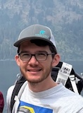
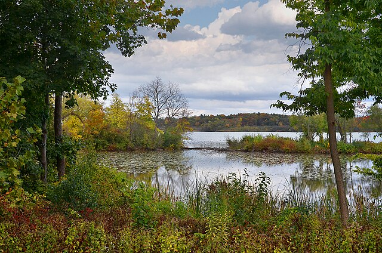
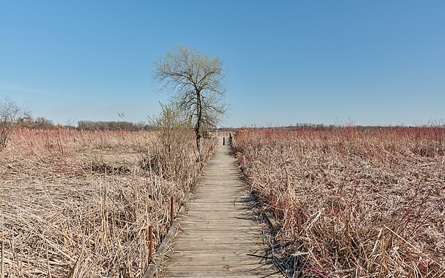
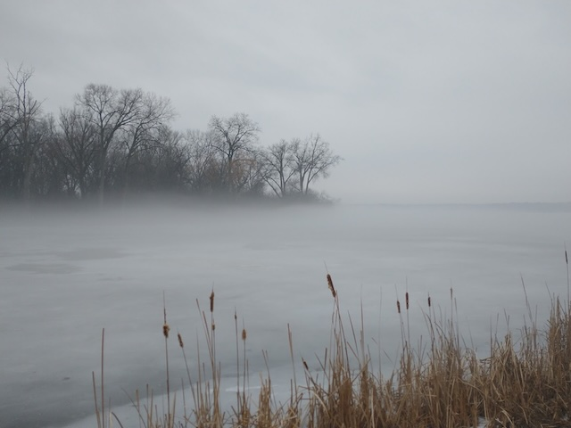

# About

## What is Lake Wingra Software?

Hello, I'm Teagan Durtschi. I created Lake Wingra Software with the goal of connecting with great people to work on interesting projects. 

Since 2022, I've been lucky to collaborate with a diverse set of different teams, including a healthcare startup, a manufacturing facility, a university lab, and a permaculture consultancy. I enjoy hitting the ground running and identifying high-impact areas to help teams improve their software products.

Do you need help building or refining your product? Let's connect! Send me an email `lakewingrasoftware@gmail.com` or DM me on [LinkedIn](https://www.linkedin.com/in/teagandurtschi/).

Looking for a [Software Engineering resume](https://lakewingrasoftware.azureedge.net/Teagan_Durtschi_Resume.pdf)?

Looking for a [Devops resume](https://lakewingrasoftware.azureedge.net/Teagan_Durtschi_Resume_DevOps.pdf)?

## About Lake Wingra

Lake Wingra is located in Madison, Wisconsin.

