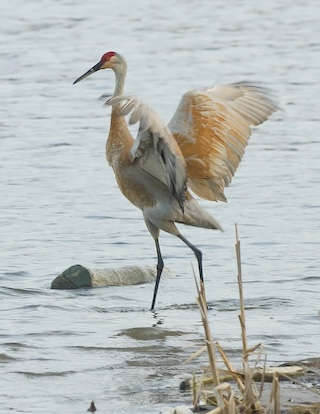

# About

## What is Lake Wingra Software?

Hello, I'm Teagan Durtschi, the creator of Lake Wingra Software. Lake Wingra Software was created to connect with great people to work on awesome software. 

Since 2022, I've collaborated with teams in various industries including healthcare, manufacturing, retail, and agriculture. I like to hit the ground running and help teams identify high-impact ways to improve their products.

## Let's Connect!

Do you need help building something new or improving your existing software? __Let's connect!__ Send me an email [lakewingrasoftware@gmail.com](mailto:lakewingrasoftware@gmail.com) or DM me on [LinkedIn](https://www.linkedin.com/in/teagandurtschi/).

## Resumes

Looking for a [Software Engineering resume](https://lakewingrasoftware.azureedge.net/Teagan_Durtschi_Resume.pdf)?

Looking for a [DevOps resume](https://lakewingrasoftware.azureedge.net/Teagan_Durtschi_Resume_DevOps.pdf)?

## About Lake Wingra

Lake Wingra is located in Madison, Wisconsin.

