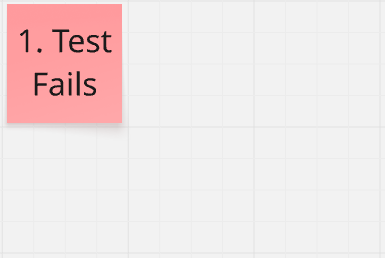
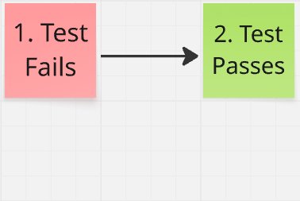
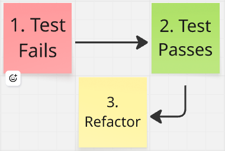
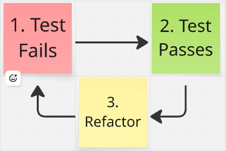
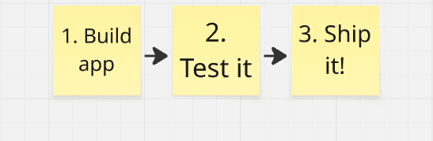
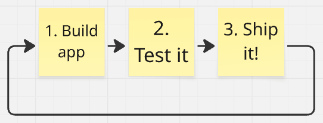

# Test Driven Development

I have found no technique that with a higher impact on software quality than __Test Driven Development__, or __TDD__. I'm a huge fan, possibly bordering on fanatic, so just know you will get a very biased view of TDD here. Most teams do not practice TDD, and since most software engineers are very bright people, I assume their reasoning is sound! But to me the results are so clear and so valuable, I just can't imagine going without.

## What is it?

TDD, or Test Driven Development, is a simple, 3-step software development practice. 

First, a developer creates a new automated test that describes some expected behavior in the code. At this point, the developer runs the test. However, the expected behavior doesn't exist, so the test will fail. 

After running the test and watching it fail, the developer writes some code that makes the test pass.

When every automated test passes, this provides an opportunity to refactor the code.

After the developer has (optionally) refactored the code, it is time to work on the next incremental feature by writing a new test.

As you can see, each of the 3 steps follows one of the others, forming a __cycle__. When developing an application, applying TDD means to repeat the cycle over and over and over again. A concise way to remember this is "__Red-Green-Refactor__".

## Why Test?

The purpose of TDD is to ensure that test coverage remains as high as possible. But test coverage isn't just a metric for its own sake. Let’s step back and ask: why is test coverage important?

First, what really matters about at the end of the day is good software. In other words, the app should work! If the code is complete and it has been rigorously tested, we can deliver the app and call it a day. 

If only it was so simple. The reality for most software is that it is never done; it is always being tweaked and improved. Top software companies like Amazon and Google push new updates to their major products daily or even multiple times a day. There is even a term for this: [__Continuous Delivery__](https://martinfowler.com/books/continuousDelivery.html).

So a tension is born. We want frequent changes to the code, and fast delivery, but we also want the app to work. All software should be expected to work properly. My point is that unless you want to pay some slow, error-prone humans to test each version of the app before it gets shipped (especially if those humans are expensive software engineers), you need comprehensive __automated tests__.

## Invest in Tests

One argument against TDD is that writing automated tests takes too long, or it is too hard. I won't argue that it takes time and can be difficult, especially for beginners. In certain cases I will admit automated tests isn't worth the price. But the other side of this equation deserves exploring, which is, what do we get for our efforts?

First, as I mentioned earlier, your automated tests replace testing by hand. In many cases __manual testing can be eliminated__ by comprehensive tests. That's probably reason enough to write automated tests.

However, beyond that lies another big return on investment in the form of __developer confidence__. This is somewhat hard to convey if you haven't experienced it, but it's undeniable for many who have worked on well-tested codebases. In short, having tests gives you freedom to make bigger, bolder changes to the code, especially __refactoring__.

When a codebase is small, it can be easy to see the various pieces and how they work together. Updating the code is easy because there isn't much to break, and if it breaks, it will be easy to notice. As time goes by, complexity creeps up. Before too long, there are dozens of components interacting with each other, and hundreds of individual features that support critical user workflows. Suddenly, the cost of breaking something is much higher. At the same time, it's harder for a developer to grasp how everything fits together, which often results in __fear__ of changing the code. But for those who invested in testing, making bold moves is no big deal, because you know that if the tests pass, your changes are correct.

## Why Test First?

One of the biggest arguments against TDD is that the whole idea of 'writing the test first' is unnecessary. To me, when you drill down on what makes a good test, the idea of writing them first naturally follows. Hear me out:

First, the main thing a good test should do is pass when things work as expected, and fail when they don't work as expected. I hope we can all agree on that, at least. As the author of such a test, a developer needs to verify both of these scenarios. In other words, try the test on 2 different versions of the code and see that the test passes under the expected condition, and fails under incorrect conditions.

I really want to drive this point: if a test has never failed, it doesn't provide much value. I have encountered many tests that look correct at first glance but never fail due to some bug in the test. 

So a test should fail. The only remaining question is, at what point in development should the test fail? If the test fails first, congratulations, you're doing TDD. If you write an implementation, then the test, then remove the implementation to watch the test fail, that's ok too, although in my opinion you're adding an unnecessary step since you must add the implementation twice. If you write the implementation and a passing test, then your test might be correct, or it might not. As for me, I want full confidence in my tests, and I don't want to introduce unnecessary steps. That's why I TDD!

## I want to learn more about TDD!

I'm happy to chat about TDD or discuss how adopting TDD could improve outcomes for your team! 

Here are some other resources to check out:

* [Test Driven Development - Martin Fowler](https://martinfowler.com/bliki/TestDrivenDevelopment.html)
* [Test Driven Development By Example - Kent Beck (Amazon)](https://www.amazon.com/Test-Driven-Development-Kent-Beck/dp/0321146530)