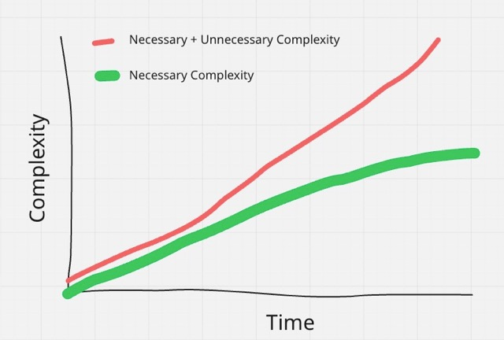
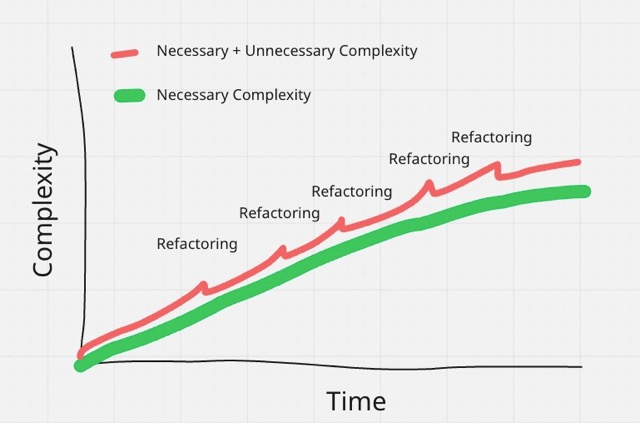

# Refactoring

[Wikipedia](https://en.wikipedia.org/wiki/Code_refactoring) defines refactoring as "restructuring existing source code—changing the factoring—without changing its external behavior." I like this definition, but it is a bit technical. A simple way to think of refactoring is cleaning or re-organizing code.

To explain why regular refactoring is important, consider this example drawn from personal experience...

## A Cautionary Tale

A new project begins with a clean slate and developers start hammering away on new features. The codebase is small, so it is easy to see the various pieces and how they fit together. Updating the code is a breeze because there isn't much that can go wrong, and if something breaks it will be easy to notice. Stakeholders are happy with the team's velocity. The team is generally small at this stage and everyone has an intuitive sense of what's going on.

Time goes by, and the complexity gradually and steadily increases. After a while, there are dozens of components interacting with each other, and hundreds of individual features supporting several critical user workflows. Each individual contributor only has a partial understanding of the whole system. 

At this point, the stakeholders are still expecting fast delivery of features. The delivery pressure means things are shipped as soon as they work. Components are added haphazardly without taking time to consider the design of the whole system, code snippets are copy/pasted, and features are shipped without tests.

At this point in development, the cost of breaking things is much higher because real users may experience outages. At the same time, it's harder for any single person to grasp how everything fits together. Reviewing code changes becomes difficult. Developers begin to lose their self-confidence and become anxious about making changes to the code. Delivery slows down, and bugs find their way into the system.

Time goes on and complexity keeps increasing. At a certain point, it becomes overwhelming. The speed of delivery tapers. Deadlines are missed. Outages happen. If this continues, progress can even grind to a halt.  Eventually, someone brings up the idea of rewriting the app. The codebase resembles a Jenga tower on the verge of collapse.

Unfortunately, this cautionary tale is based on my own real-world experience on a few different teams. Without taking __proactive__ steps to manage the complexity, software projects often follow a trajectory similar to the one in this story. What can be done to prevent this situation for new projects? And how can we recover from this situation in existing projects?

## On Complexity

One important point about complexity is that it can be broken down into two categories: __necessary__ and __unnecessary__ complexity. 

For any given application, certain complexity is baked in, or __necessary__. Put another way, this is "business logic". For example, an double-entry accounting app must record each entry in two accounts, a social media app must store relationships between users, and a game must keep track of the player's state.

Sometimes complexity is __unnecessary__. For example, a double-entry accounting app uses the term 'entry' in some places but refers to entries as 'transactions' in other places. Unnecessary complexity is a natural side effect of programming. I'd put over-engineered code and duct-tape fixes into this category as well.

Here is a conceptual graph showing the typical progression of necessary and unnecessary complexity in a codebase without refactoring:

## Why Refactor?

By distinguishing necessary and unnecessary complexity, it's easy to see that the only way to bring down the __total__ complexity is to tackle __unnecessary__ complexity. The mechanism we use to do this is refactoring, meaning, that we update the code to simplify it without changing the underlying behavior of the app. If we want to deliver with high speed and confidence over a long time period, we must refactor. 

When refactoring becomes a regular part of development, it can make a __significant impact__ on the overall complexity:

## Refactoring Confidently

Although the problem and solution are easily stated, the work of refactoring can be extremely challenging! And it's challenging for the same reason that all code changes are challenging: developers become overwhelmed by complexity, and lose confidence that they can change things without breaking them (remember from the definition of 'refactoring' that the behavior of the application cannot change). 

To refactor successfully, we need to avoid becoming overwhelmed, and this is mainly a preventative effort. Refactoring should begin early on in the project, and be a regular part of development. It's routine maintenance.

_"A stitch in time saves nine."_

We also need to make sure the developers have confidence that their changes are correct. This is primarily done through automated testing. [Test-Driven Development](../01-%20tdd/) is __the best way__ to achieve good test coverage. Like refactoring, this is most effective when started early and made a regular part of development.

## When is it Too Late?

In an ideal world, all codebases would get the necessary regular maintenance. But in the real world, this doesn't always happen. What can be done about applications that are already facing significant challenges, like the one I described in my cautionary tale?

Unfortunately, this is a very challenging situation and teams can spend a lot of resources digging themselves out of this hole! 

The hole may be deep, but the basic approach is the same. Validating the expected app behavior with automated tests is paramount, as this creates the confidence needed for major code changes. More often than not, collaboration with users & business stakeholders will be necessay to even define the expected program behavior.

Next, refactoring tasks should be identified and the team should consider the cost/benefit of each. A [2x2 prioritization](https://labspractices.com/practices/2x2/) exercise can be useful to identify the highest priority changes.

In extreme cases, a rewrite may be the best option. However, this carries major costs and should be considered only as a last resort (in my opinion). A lite variant of this would be a targeted rewrite of certain components, which can provide some benefit without the effort of recreating the entire application from scratch.

## Learn More About Refactoring

Would you like to learn more about how regular refactoring can improve your team's software delivery? Are you struggling with slow progress and buggy software updates? [Let's chat](../../1.%20Lake%20Wingra%20Software/01%20-%20whoAreWe/#lets-connect)!