# Birds on Bicycles

A photo diary of 20 birds and their favorite bicycles. All artwork created with ✨ Claude Sonnet 4.6 ✨.

```markdown
Generate 20 SVGs of various waterfowl riding various bicycles. 
For each SVG:
  - Choose a type of bird, and a specific style of bicycle.
  - Create an SVG illustrating the bird on the bicycle.
  - save using filename: fowl-{i}.svg
```


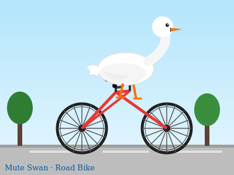


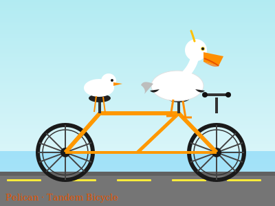


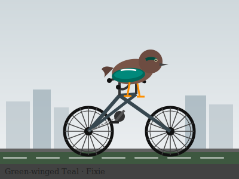


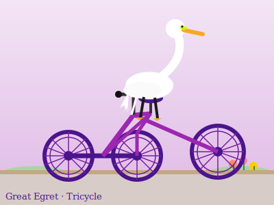


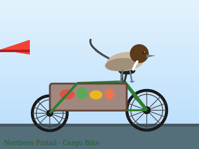

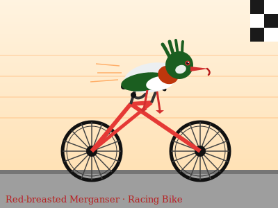


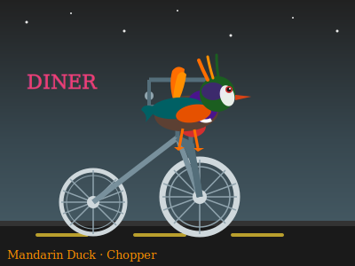

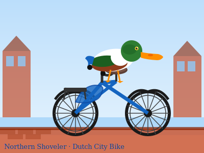

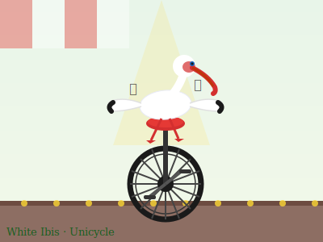

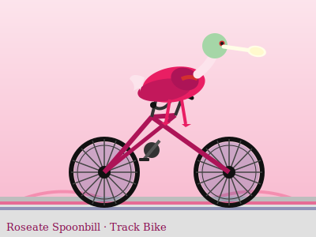

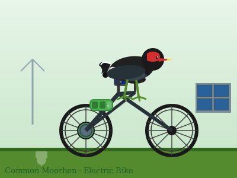

