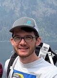
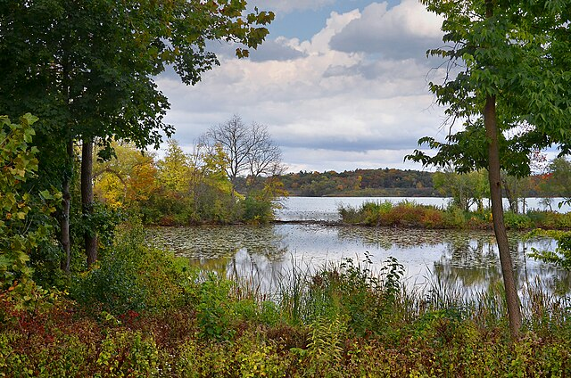
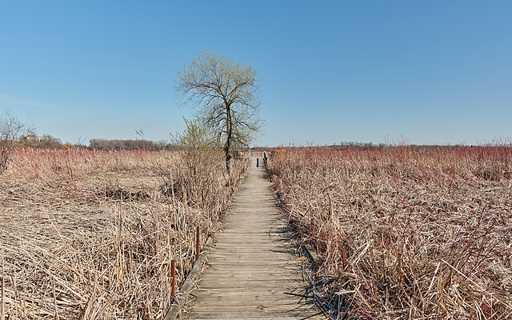
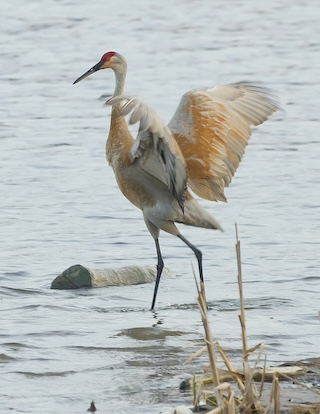
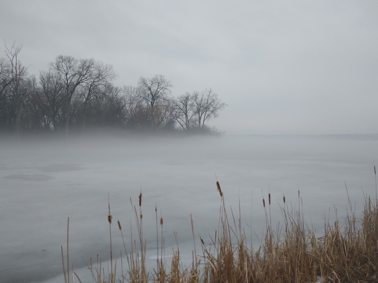

# Lake Wingra Software

Hello! My name is Teagan Durtschi. I created Lake Wingra Software in order to connect with great people to build awesome software. 

Since 2022, I've collaborated with many teams in industries such as healthcare, manufacturing, retail, and agriculture. I like to hit the ground running and help teams identify high-impact ways to improve their products.

I believe that investing in high-quality code results in better business outcomes. My approach integrates [Test-Driven Development](./1.%20Software%20Engineering%20Practices/01-%20tdd/), [refactoring](./1.%20Software%20Engineering%20Practices/02-%20refactoring/), and DevOps automation to ensure fast, bug-free delivery.

## Worth with Lake Wingra Software

Do you need help building something new or improving your existing software? __Let's connect!__

Send me an email [lakewingrasoftware@gmail.com](mailto:lakewingrasoftware@gmail.com) or a message on [LinkedIn](https://www.linkedin.com/in/teagandurtschi/).

## About Lake Wingra

While Lake Wingra _Software_ is currently based in Minnesota, Lake Wingra is located in Madison, Wisconsin.

